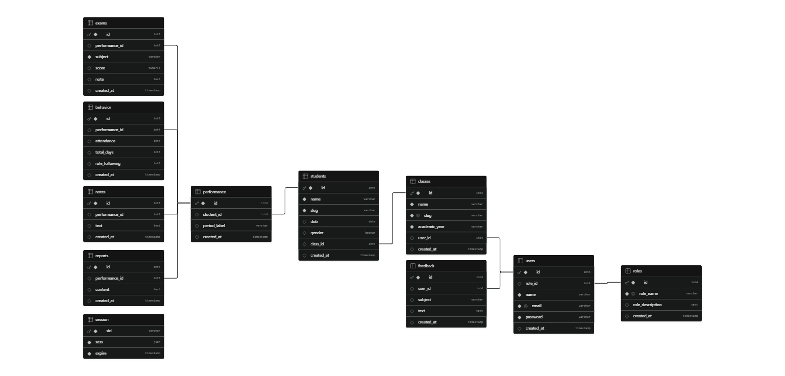

# 📝 Student Report App

An AI-powered web application that helps teachers manage classes, track student performance, and generate professional progress reports using Google Gemini AI.

> Built as a real-world tool for teachers in Vietnam who struggle with manual student reporting.

---

## 🌐 Live Demo

[Live App →](https://teacher-report-app.onrender.com)

**Test Account:**
- Email: `user1@example.com`
- Password: `P@$$w0rd!`

---

## ✨ Features

- **Class Management** — create and manage multiple classes across academic years
- **Student Management** — add students to classes, track individual profiles
- **Performance Tracking** — record exam scores, behavior, attendance, and notes per evaluation period
- **AI Report Generation** — generate professional Vietnamese progress reports using Google Gemini AI
- **Editable Reports** — review and edit AI-generated reports before saving
- **Report History** — view all past performance records and reports per student
- **Role-based Access** — admin and teacher roles with protected routes

---

## 🛠 Tech Stack

**Backend**
- Node.js + Express.js
- PostgreSQL (Supabase)
- express-session + connect-pg-simple
- bcrypt (password hashing)

**Frontend**
- Vanilla JavaScript (ES Modules)
- EJS templating
- CSS (custom design system)

**AI**
- Google Gemini 2.5 Flash API

**Deployment**
- Render (web service)
- Supabase (managed PostgreSQL)

---

## 📐 Architecture

MVC (Model-View-Controller) with a REST API layer:

```
src/
├── controllers/       # request handling logic
├── models/            # database queries (PostgreSQL)
├── routes/            # URL routing
├── views/             # EJS templates
│   └── partials/      # reusable header/footer
├── middleware/        # auth, local variables
├── public/            # static assets
│   ├── js/            # frontend JavaScript
│   └── css/           # stylesheets
├── utils/             # AI prompt building, Gemini API calls
└── server.js          # app entry point
```

---

## 🗄 Database Schema



**Main tables:**
- `users` — teachers and admins
- `classes` — classes with academic year, linked to teacher
- `students` — students linked to a class
- `performance` — evaluation period per student (midterm, final, monthly)
- `exams` — subject scores per performance period
- `behavior` — attendance and rule-following per period
- `notes` — teacher notes per period
- `reports` — AI-generated report content per period

---

## 🚀 Getting Started (Local)

**Prerequisites:** Node.js 18+, PostgreSQL or Supabase account

**1. Clone the repo**
```bash
git clone https://github.com/thanhthu2411/teacher-report-app.git
cd teacher-report-app
```

**2. Install dependencies**
```bash
pnpm install
```

**3. Set up environment variables**

Create a `.env` file in the root:
```
DATABASE_URL=your_supabase_connection_string
SESSION_SECRET=any_long_random_string
GEMINI_API_KEY=your_gemini_api_key
NODE_ENV=development
PORT=3000
```

**4. Run the app**
```bash
pnpm run dev
```

Visit `http://localhost:3000`

---

## 🤖 AI Report Generation

Reports are generated using Google Gemini 2.5 Flash. The prompt is built from:
- Student name, class, teacher name
- Exam scores per subject
- Attendance and behavior rating
- Teacher notes

Reports are written in Vietnamese, addressed to parents, and highlight strengths with one area for improvement. Teachers can edit the generated text before saving.

---

## 🔒 Security

- Passwords hashed with bcrypt (10 salt rounds)
- Sessions stored in PostgreSQL via connect-pg-simple
- All routes protected with requireLogin middleware
- Parameterized SQL queries throughout (prevents SQL injection)
- httpOnly cookies (prevents XSS cookie theft)

---

## 📋 Known Limitations

- Edit class and edit student features not yet implemented
- No PDF/Word export yet (planned)
- No parent-facing portal
- Single language UI (Vietnamese reports only)

---

## 👩‍💻 Author

Built by Thu Dong — CS student at BYU-Idaho

---

## 📄 License

MIT
